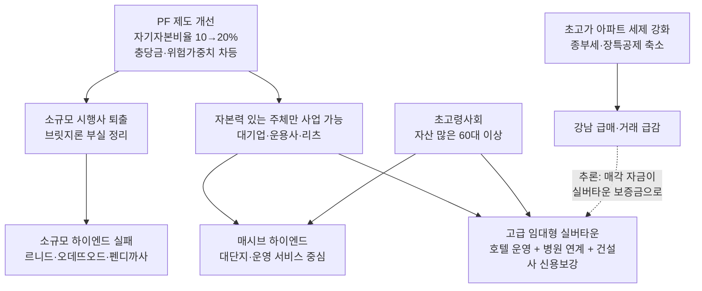

# 부동산 PF · 실버타운 · 고급주택의 최근 현황과 상호 관계

- 작성일: 2026-09-08
- 기준 시점: 2026년 상반기~9월 초 공개 자료 (금융위원회·금융감독원 발표, 주요 경제지 보도)
- 목적: 세 시장의 최근 현황을 정리하고, 서로 어떻게 맞물려 움직이는지 구조적으로 설명

> **읽기 전 유의사항**
> - 아래 수치는 기사·보도자료에 나온 값을 그대로 옮긴 것이고, "관계" 부분의 해석은 제가 자료를 근거로 추론한 내용입니다. 추론 부분은 본문에 `[추론]`으로 표시했습니다.
> - 일부 근거 자료는 2024~2025년 것입니다. 정책 방향은 그대로 유지되고 있지만, 개별 수치는 최신 발표로 다시 확인하는 것이 안전합니다.
> - 분양형 실버타운을 허용하는 노인복지법 개정안이 2026년 9월 현재 **시행 단계인지**는 이번 조사에서 확인하지 못했습니다. 법 개정 상태는 별도 확인이 필요합니다.

---

## 1. 한 줄 요약

**PF 규제가 "돈 없는 시행사는 사업을 못 하게" 바뀌면서, 자본력 있는 대기업·운용사·리츠만 살아남는 구조가 됐다.** 그 결과 실버타운은 대기업 중심의 "고급 임대형" 상품으로, 고급주택은 소규모 하이엔드에서 대단지(매시브 하이엔드)로 재편되고 있다. 두 상품은 모두 **자산이 많은 60대 이상 고령층**을 같은 수요층으로 겨냥한다.

---

## 2. 부동산 PF 최근 현황 (2026년 상반기)

### 2-1. 핵심 지표 (2026년 3월 말 기준, 금융위·금감원 7월 3일 발표)

| 지표 | 수치 | 전분기 대비 |
|---|---|---|
| PF 익스포저(위험노출액) | 169조 8,000억 원 | 전년 말 대비 4조 5,000억 원 감소 |
| 금융권 PF 대출 잔액 | 115조 5,000억 원 | 5,000억 원 감소 |
| PF 대출 연체율 | 4.65% | +0.77%p 상승 |
| 중소금융 토지담보대출 연체율 | 31.88% | +2.20%p 상승 |
| 유의(C)·부실우려(D) 여신 | 16조 4,000억 원 (전체의 9.6%) | +1조 7,000억 원 |
| 누적 정리·재구조화 완료 | 18조 9,000억 원 (정리 13조 6,000억, 재구조화 5조 3,000억) | - |

- 익스포저는 2024년 6월 216조 5,000억 원에서 꾸준히 줄어드는 중이다. 규모는 줄었지만 **연체율은 다시 오르고 있다**. 즉 "좋은 사업장은 정리되고, 남은 사업장은 더 나쁘다"는 뜻이다.
- 금융당국은 한시적 규제완화 9건 중 6건(임직원 면책, 신규자금 건전성 별도분류, 보험사 K-ICS 위험계수 완화, 저축은행 PF 유가증권 보유한도 완화 등)을 **2026년 말까지 재연장**했다.

### 2-2. 브릿지론이 새 뇌관

- 매각이 진행 중인 전국 PF 사업장 258곳(2026년 5월 말) 중 **78.7%(203곳)가 착공 전** 단계다.
- 경공매 추진 잔액 10조 6,000억 원 중 9조 1,000억 원이 인허가·착공 전 브릿지론이다(2025년 9월 말 기준).
- 2026년 4분기 만기 도래 PF 채권만 약 13조 4,800억 원으로, 시장은 **2026년 하반기를 "PF 만기 리스크 정점 구간"**으로 본다.

### 2-3. 제도 개선: 시행사 자기자본비율 상향

| 연도 | 목표 자기자본비율 |
|---|---|
| 과거 관행 | 3~5% 수준 |
| 2026년 | 10% |
| 2027년 | 15% |
| 2028년 | 20% |

- 자기자본비율이 낮을수록 금융사가 쌓아야 하는 위험가중치·충당금이 커진다. 금융사 입장에서는 자본 없는 시행사에 돈을 빌려주면 손해라서, **자연스럽게 대출을 거절**하게 된다.
- "3억 들고 100억 사업"을 하던 소규모 시행사 모델이 사실상 막힌다. 이것이 아래 실버타운·고급주택 시장 변화의 출발점이다.

---

## 3. 실버타운(시니어 레지던스) 최근 현황

### 3-1. 수요 배경

- 65세 이상 인구 비율 20.3%로 초고령사회 진입. 2026년부터 베이비부머가 본격적으로 시니어 세대에 들어간다.
- 60세 이상 가구 순자산 5억 3,591만 원, 주택 소유율 41.7%로 다른 연령대보다 자산이 많다. 즉 **돈 있는 고령층**이 두터운 것이 실버타운 수요의 핵심이다.
- 서울시는 2035년까지 시니어주택 12,000가구 공급을 목표로 한다.

### 3-2. 정부 정책 (2024년 7월 「시니어 레지던스 활성화 방안」 이후)

- 토지·건물 **사용권만으로도** 실버타운 설립·운영을 허용(소유권 없어도 됨).
- 임대형을 일정 비율 포함하는 **신(新)분양형 실버타운**을 89개 인구감소지역에 도입 추진(노인복지법 개정 필요).
- 유주택 고령자도 입주 가능한 민간임대 **실버스테이** 시범사업.
- 리츠 진입 규제 완화, 주택도시기금 공공지원 민간임대 융자, 지역활성화 투자펀드 지원 대상에 분양형 실버타운 포함 검토.

### 3-3. 시장 움직임: 대기업·운용사 중심의 고급화

| 사업 | 주체 | 위치 | 규모·조건 |
|---|---|---|---|
| 소요한남 by 파르나스 | 포스코이앤씨 시공, 파르나스호텔 운영 | 용산구 한남동 | 보증금 52~60억 원(전용 108㎡), 월 264만 원, 111가구 모집에 1,483명 신청(13.4:1) |
| VL르웨스트 | 롯데건설·롯데호텔 | 강서구 마곡 | 보증금 최대 22억 원, 월 300~450만 원 |
| 은평 시니어 레지던스 | 현대건설·이지스자산운용 | 은평구 진관동 | 214가구, 본PF 2,500억 원 |
| 파크로쉬 서울원 | HDC현대산업개발 | 노원구 광운대역세권 | 서울아산병원 협업, 2026년 4월 분양 |
| 위례 심포니아 | 한미글로벌 | 송파구 위례 | 115가구 |
| 평창 카운티 | 이지스자산운용·KB골든라이프케어 | 종로구 평창동 | 164가구 |

- 신세계프라퍼티, 엠디엠그룹(동탄2 헬스케어 리츠 2,550가구) 등도 진입. 공통점은 **호텔 운영 노하우 + 병원 연계 + 대기업 신용**이다.

### 3-4. 자금조달 구조의 특징 (현대건설 은평 사례)

- 본PF 2,500억 원 = 트랜치A 1,250억 + 트랜치B 450억 + 트랜치C(후순위) 800억.
- 현대건설이 후순위 800억 원에 **자금보충·채무인수 의무**를 약정(신용보강). 주관사는 한국투자증권.
- 실버타운(노인복지주택)은 원칙적으로 **임대형**이라 분양대금으로 공사비를 회수할 수 없다. 그래서 PF 의존도가 높고, 대주단은 건설사의 신용보강을 요구한다. 이것이 중소 시행사가 실버타운에 들어오기 어려운 구조적 이유다.

---

## 4. 고급주택(하이엔드 주거) 최근 현황

### 4-1. 소규모 하이엔드의 실패 (PF 부실의 대표 사례)

| 사업 | 분양 조건 | 결과 (2025년 9월 기준) |
|---|---|---|
| 서초 르니드 | 22평 26~30억 원대 | 156실 중 약 100실 미분양, 공매 8차례 대부분 유찰, 상가 16실 전부 미분양 |
| 오데뜨오드 도곡 | 평당 7,300만 원 | 84실 중 77실 미분양, 공매 12차례 유찰(최저입찰가 1,829억 → 900억 원대), 형사 고소 진행 |
| 포도 바이 펜디 까사 | 펜트하우스 200억 원 이상 | 사업 좌초, 공매 4차례 유찰(감정가 3,183억 → 2,000억 원대) |

- 원인: 강남 입지만 믿은 비현실적 분양가, 금리 인상·공사비 상승, 실수요층 부재. 브릿지론에서 본PF로 넘어가지 못한 채 제2금융권에서 부실이 터지는 전형적 패턴이다.

### 4-2. 살아남는 하이엔드: 대단지(매시브 하이엔드)로 이동 (2026년 9월 8일 보도)

| 사업 | 지역 | 규모 |
|---|---|---|
| 더파크사이드 서울 | 용산구 | 아파트 419가구 + 오피스텔 775실 |
| 목동윤슬자이 | 양천구 목동 | 651실 |
| 아크메르 동탄 | 화성시 동탄 | 1,808가구 |
| 성수동 복합개발 | 성동구 | 공동주택 403가구 + 오피스텔 61실 |
| 압구정3구역 | 강남구 | 5,175가구 |

- "작을수록 고급"이라는 공식이 깨졌다. 소규모 단지는 커뮤니티 시설을 만들 부지가 없고, 소수 가구가 관리비를 나누다 보니 부담이 크며, 자산 평가에서도 불리하다.
- 2026년 하이엔드의 경쟁력은 시설 자체보다 **운영 콘텐츠·서비스**로 이동했다. 이 점은 호텔 운영사가 붙는 고급 실버타운과 정확히 같은 방향이다.

### 4-3. 기존 초고가 아파트: 세제 불확실성으로 급매·거래 급감 (2026년 8~9월)

| 단지 | 최고 거래가 | 현재 호가 |
|---|---|---|
| 압구정 신현대 170㎡ | 99억 원 | 78억 원 |
| 대치 한보미도맨션 159㎡ | 55억 5,000만 원 | 47억 원 |
| 반포 래미안퍼스티지 84㎡ | 57억 5,000만 원 | 44억 5,000만 원 |

- 종부세 세율 인상(초고가 집중), 장기보유특별공제 한도 축소 예고(2028년까지 20억 → 2029년 10억).
- 강남·서초는 3주 연속 하락(강남 -0.41%, 서초 -0.23%). 강남 3구 거래 비중은 5월 16.1%에서 8월 9.1%로 급감, 서울 8월 매매 2,322건으로 전월 대비 60% 감소.
- 반면 중저가 지역(동대문·성동·중랑·성북)은 상승. 서울 안에서 **고가와 중저가의 탈동조화(디커플링)**가 심해지고 있다.

---

## 5. 세 시장의 상호 관계

### 5-1. 관계도

### 5-2. 관계 ① PF 규제 → 사업 주체의 교체

- 자기자본비율 상향과 사업성 평가(C·D 등급 충당금)는 **"누가 개발을 할 수 있는가"**를 바꾼다. 소규모 시행사가 브릿지론으로 땅부터 사던 방식은 막히고, 자기자본을 10~20% 넣을 수 있는 대기업·운용사·리츠만 남는다.
- 실버타운 진입 기업 목록(현대건설, 롯데, 신세계, 포스코이앤씨, HDC, 이지스, 엠디엠)과 매시브 하이엔드 공급 주체(삼성물산, 현대건설, GS건설 등 대형사)가 겹치는 이유가 여기에 있다.

### 5-3. 관계 ② 소규모 하이엔드의 실패가 실버타운·대단지의 반면교사

- 서초 르니드·오데뜨오드는 "강남 + 소규모 + 초고가 분양"으로 PF 부실의 전형이 됐다. 금융사는 같은 유형에 다시 돈을 빌려주지 않는다.
- 그래서 고급 주거의 자금은 (a) 커뮤니티·운영 서비스가 가능한 대단지, (b) 확실한 수요층(고령 자산가)이 있고 대기업 신용보강이 붙는 실버타운으로 이동한다. `[추론]` 이는 금융사 입장에서 "분양 리스크 대신 운영·임대 수익 + 대기업 보증"을 선택하는 것으로 볼 수 있다.

### 5-4. 관계 ③ 같은 고객, 다른 상품

- 두 상품 모두 순자산 5억 원 이상, 주택 보유율 41.7%의 60대 이상을 겨냥한다. 소요한남 보증금 60억 원과 강남 초고가 아파트 가격대는 사실상 같은 지갑을 놓고 경쟁한다.
- `[추론]` 종부세·장특공제 강화로 강남 초고가 아파트를 처분하는 자산가가 늘면, 그 자금 일부가 보유세 부담이 없는 **임대형 실버타운 보증금**으로 옮겨갈 유인이 있다. 소요한남 청약 13.4:1은 이 흐름과 맞물려 해석할 수 있다. 다만 이를 직접 입증한 통계는 아직 없다.

### 5-5. 관계 ④ 실버타운은 PF 규제 완화·강화 양쪽의 영향을 동시에 받음

- 완화 측면: 정부는 실버타운을 정책적으로 밀어주고 있어(주택도시기금 융자, 리츠 규제 완화, 지역활성화펀드) 자금조달 경로가 다른 개발보다 넓다.
- 강화 측면: 그래도 노인복지주택은 임대형이라 분양대금 회수가 없고, PF 대주단은 후순위에 건설사 신용보강을 요구한다(현대건설 은평 사례 800억 원). 자기자본비율 20% 시대에 이 구조를 감당할 수 있는 곳은 대기업뿐이다.
- 분양형 실버타운(노인복지법 개정)이 실제 시행되면 중소 시행사에도 길이 열릴 수 있지만, 인구감소지역 89곳 한정이라 서울·수도권 고급 실버타운과는 시장이 다르다.

---

## 6. 2026년 하반기 리스크 체크리스트

| 구분 | 리스크 | 왜 중요한가 |
|---|---|---|
| PF | 4분기 만기 13조 4,800억 원, 연체율 재상승 | 브릿지론 부실이 추가로 터지면 제2금융권 유동성이 다시 조여 실버타운·하이엔드 본PF 조달 금리도 오른다 |
| PF | 자기자본비율 2027년 15%로 추가 상향 | 지금 브릿지 단계인 사업장은 내년 본PF 전환이 더 어려워진다 |
| 실버타운 | 노인복지법 개정(분양형) 시행 여부 미확인 | 분양형 허용 여부에 따라 사업 구조·수익성이 완전히 달라진다 |
| 실버타운 | 임대형의 초기 투자 회수 지연 | 보증금 반환 의무가 있어, 운영사 부실 시 입주자 피해로 직결된다 |
| 고급주택 | 세제 개편 최종안 미확정 | 자산가 관망이 길어지면 매시브 하이엔드 분양에도 영향 |
| 고급주택 | 남은 소규모 하이엔드 공매 물량 | 유찰이 반복되면 감정가 하락이 인근 시세·담보가치에 전이 |

---

## 7. 출처

### 부동산 PF
- [PF 익스포저 줄었지만 연체율 상승…당국, 규제완화 연말까지 연장 - 머니투데이 (2026-07-03)](https://www.mt.co.kr/finance/2026/07/03/2026070314152973913)
- [부동산 PF 익스포저 169.8조로 개선…연체율은 상승 - 아시아투데이 (2026-07-03)](https://www.asiatoday.co.kr/kn/view.php?key=20260703010001329)
- [부동산 프로젝트 금융(PF) 상황 점검회의 개최 - 금융위원회](https://www.fsc.go.kr/no010101/85924)
- [금융당국, 부동산 PF 한시적 규제완화 6건 연말까지 연장 - 파이낸셜뉴스](https://www.fnnews.com/news/202607031645131532)
- [부동산PF '연착륙' 진입했지만…잔여 부실·규제 강화는 변수 - 네이트뉴스 (2026-04-07)](https://news.nate.com/view/20260407n05811)
- [부동산 PF 구조조정, 하반기가 '진짜 고비'…브릿지론 10조 적체·만기 집중 - 베타뉴스 (2026-06-09)](https://www.betanews.net/article/view/beta202606090007)
- [PF 매물 70% 털었지만…새 뇌관 된 브릿지론 - 뉴스토마토](http://www.newstomato.com/ReadNews.aspx?no=1304405)
- [부동산 PF 제도 개선방안 - 금융위원회](https://www.fsc.go.kr/comm/getFile?srvcId=BBSTY1&upperNo=83403&fileTy=ATTACH&fileNo=4)
- [시행사 자기자본 20% 수준으로 상향…부동산 PF 제도 손 본다 - 한국경제](https://www.hankyung.com/article/2024111300536)
- [부동산 PF 자본확충의 효과와 제도개선 방안 - KDI FOCUS](https://www.kdi.re.kr/research/focusView?pub_no=18876)

### 실버타운 · 시니어 레지던스
- [규제 풀어 민간사업자 진입 촉진, 시니어 레지던스 대폭 확대 - 정책브리핑](https://www.korea.kr/briefing/pressReleaseView.do?newsId=156642271)
- [실버타운 설립 쉬워진다…정부, 시니어 레지던스 활성화 방안 발표 - 정책브리핑](https://www.korea.kr/news/policyNewsView.do?newsId=148931786)
- [시니어 레지던스 활성화 방안 주요 내용 - 김·장 법률사무소](https://www.kimchang.com/ko/insights/detail.kc?sch_section=4&idx=30016)
- [슬기로운 시니어 주거생활: 시니어 레지던스 시장을 중심으로 - PwC Korea](https://www.pwc.com/kr/ko/insights/issue-brief/senior-residence.html)
- ['보증금 60억'에도 흥행한 최고급 실버타운…시니어주택 뜨나 - 이데일리 (2026-05-31)](https://www.edaily.co.kr/News/Read?newsId=01256246645454496)
- [끝없는 수요, 시니어 레지던스: 2026 소요 한남, 파크로쉬 서울원 분양 (2026-04-01)](https://www.sankun.com/blog/detail/1505)
- [현대건설, '은평 시니어 레지던스' 본PF 후순위 800억 신용보강 - 블로터 (2025-02-21)](https://www.bloter.net/news/articleView.html?idxno=631901)
- [실버타운 사업에 대기업·운용사·건설사·시행사 '큰 손들' 나섰다 - 이데일리 마켓인 (2024-06-18)](https://marketin.edaily.co.kr/News/Read?newsId=01459606638923032)
- [초고령사회 본격화…건설사들 시니어 레지던스 판 키운다 - 오피니언뉴스](https://www.opinionnews.co.kr/news/articleView.html?idxno=135220)
- [건설사에 호텔까지…'새 먹거리' 시니어 레지던스 꼽은 이유는? - 시사저널](https://www.sisajournal.com/news/articleView.html?idxno=346430)

### 고급주택 · 하이엔드
- [하이엔드도 '규모의 경제'... 1000가구 넘는 '매시브 하이엔드' 주목 - 서울경제 (2026-09-08)](https://www.sedaily.com/article/20088327)
- ['작을수록 고급' 공식 깨졌다…하이엔드도 대단지 경쟁 - EBN](https://www.ebn.co.kr/news/articleView.html?idxno=1723337)
- [집을 사는가, 시간을 사는가… 2026 하이엔드 주거의 진짜 조건 - 다음](https://v.daum.net/v/9xRzAwEoWn)
- ['22평에 30억' 꿈꾸던 강남 하이엔드, 줄줄이 미분양·공매 신세로 - 르데스크 (2025-09-15)](https://v.daum.net/v/pX75hnCnQK)
- ["99억 찍던 아파트가 78억에"… 종부세 폭탄 피하려 강남 초고가 급매 쏟아진다 - 더퍼블릭 (2026-08-22)](https://www.thepublic.kr/news/articleView.html?idxno=315706)
- [강남 아파트 거래 비중 9.1% '연중 최저' - 헤럴드경제 (2026-09-07)](https://biz.heraldcorp.com/article/10864815)
- [강남 털고 외곽으로? 강남·서초 '3주 연속 하락' - 헤럴드경제](https://biz.heraldcorp.com/article/10854211)
