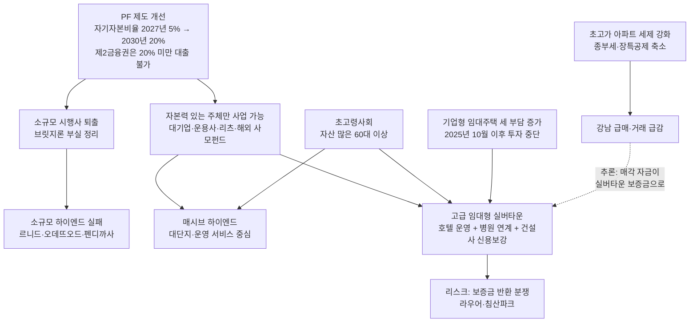

# 부동산 PF · 실버타운 · 고급주택의 최근 현황과 상호 관계

- 작성일: 2026-09-08 (2차 조사 반영 개정)
- 기준 시점: 2026년 상반기~9월 초 공개 자료 (금융위원회·금융감독원 발표, 국토교통부, 주요 경제지 보도)
- 목적: 세 시장의 최근 현황을 정리하고, 서로 어떻게 맞물려 움직이는지 구조적으로 설명

> **읽기 전 유의사항**
> - 아래 수치는 기사·보도자료에 나온 값을 그대로 옮긴 것이고, "관계" 부분의 해석은 제가 자료를 근거로 추론한 내용입니다. 추론 부분은 본문에 `[추론]`으로 표시했습니다.
> - **1차 보고서에서 수정한 부분**: PF 자기자본비율 상향 일정은 2024년 11월 발표(2026년 10%→2028년 20%)가 아니라 **2025년 12월 22일 세부방안(2027년 5%→2030년 20%)**이 최종 기준입니다. 1차 보고서의 일정표는 틀린 것이어서 바로잡았습니다.
> - 분양형 실버타운을 허용하는 노인복지법 개정은 2026년 9월 현재 **국회 통과·시행을 확인할 수 있는 자료가 없습니다**. 2024년 정부 발표 이후 진전이 공개된 것이 없어, "추진 중이지만 미시행"으로 보는 것이 안전합니다.
> - 2026년 6월 말 기준 PF 공식 통계는 아직 발표되지 않았습니다(통상 9~10월 발표). 최신 공식 수치는 3월 말 기준입니다.

---

## 1. 한 줄 요약

**PF 규제가 "자기자본 없는 시행사는 사업을 못 하게" 바뀌면서, 자본력 있는 대기업·운용사·리츠·해외 사모펀드만 살아남는 구조가 됐다.** 그 결과 실버타운은 대기업 중심의 "고급 임대형" 상품으로, 고급주택은 소규모 하이엔드에서 대단지(매시브 하이엔드)로 재편되고 있다. 두 상품은 모두 **자산이 많은 60대 이상 고령층**을 같은 수요층으로 겨냥한다. 다만 실버타운은 보증금 반환 분쟁(부산 라우어)과 사업 무산(대구 침산파크) 사례가 이미 나오고 있어, "수요가 많다"와 "사업이 된다"는 별개다.

---

## 2. 부동산 PF 최근 현황

### 2-1. 핵심 지표 추이 (금융위·금감원 분기 발표)

| 지표 | 2025년 9월 말 | 2025년 12월 말 | 2026년 3월 말 (최신) |
|---|---|---|---|
| PF 익스포저(위험노출액) | 177조 9,000억 | 174조 3,000억 | **169조 8,000억** |
| 금융권 PF 대출 잔액 | 116조 4,000억 | - | 115조 5,000억 |
| PF 대출 연체율 | 4.24% | 3.88% | **4.65% (+0.77%p)** |
| 중소금융 토지담보대출 연체율 | 32.43% | 29.68% | **31.88% (+2.20%p)** |
| 유의(C)·부실우려(D) 여신 | 18조 2,000억 (10.2%) | 14조 7,000억 (9.4%) | **16조 4,000억 (9.6%)** |
| 누적 정리·재구조화 | - | 18조 5,000억 | 18조 9,000억 (정리 13.6조, 재구조화 5.3조) |
| 신규 PF 취급액(분기) | 20조 6,000억 | 20조 7,000억 | - |

- 익스포저는 2024년 말 202조 3,000억 원에서 1년 새 약 30조 원 줄었다. 그런데 2026년 1분기에 **연체율과 부실 여신이 다시 늘었다**. 정리가 쉬운 사업장은 이미 팔렸고, 남은 것은 팔리지 않는 사업장이라는 뜻이다.
- 신규 PF는 분기 20조 원대로 꾸준히 나간다. 사업성이 좋은 곳에는 돈이 돌고, 나쁜 곳은 계속 막혀 있는 **양극화**가 PF 시장 안에서도 진행 중이다.
- 금융당국은 한시적 규제완화 조치 중 6건(임직원 면책, 신규자금 건전성 별도분류, 보험사 K-ICS 위험계수 완화, 저축은행 PF 유가증권 보유한도 완화 등)을 **2026년 말까지 재연장**했다(7월 3일 발표).

### 2-2. 브릿지론이 새 뇌관

- 매각 진행 중인 전국 PF 사업장 258곳(2026년 5월 말) 중 **78.7%(203곳)가 착공 전** 단계다.
- 경공매 추진 잔액 10조 6,000억 원 중 9조 1,000억 원이 인허가·착공 전 브릿지론이다(2025년 9월 말 기준).
- 2026년 4분기 만기 도래 PF 채권만 약 13조 4,800억 원. 시장은 **2026년 하반기를 "PF 만기 리스크 정점 구간"**으로 본다.

### 2-3. 제도 개선: 자기자본비율 기준 (2025년 12월 22일 금융위 세부방안, 최종 기준)

| 적용 연도 | 기준 자기자본비율 | 비고 |
|---|---|---|
| 2026년 | 준비 기간 | 증권사 위험가중치·충당금 일부는 2026년 상반기 선적용 |
| 2027년 | 5% | 신규 취급분부터 적용 |
| 2028년 | 10% | |
| 2029년 | 15% | |
| 2030년 | 20% | 최종 목표 |

- 은행: 자기자본비율 기준 충족 시 위험가중치 150% → 최대 100%로 인하. PF 신용공여는 전체의 20% 이내.
- 증권사: 자기자본 100% 이내에서만 부동산 투자 가능.
- **저축은행·상호금융·여전사·새마을금고: 사업비 대비 자기자본 20% 기준으로 대출 취급 여부 자체를 판단** (미충족 시 사실상 대출 불가).
- 상호금융은 별도로 PF 대출을 총대출의 20% 이내, 부동산·건설업 대출 합산 50% 이하로 제한(2027년 4월 시행).
- 의미: 2027년 이후 제2금융권 브릿지론으로 땅부터 사던 소규모 시행사 모델은 막힌다. `[추론]` 2026년은 기존 방식으로 본PF 전환을 시도할 수 있는 마지막 해이고, 이 때문에 하반기 만기 집중과 맞물려 부실이 한꺼번에 드러날 가능성이 있다.

---

## 3. 실버타운(시니어 레지던스) 최근 현황

### 3-1. 수요 배경

- 65세 이상 인구 비율 20.3%로 초고령사회 진입. 2026년부터 베이비부머가 본격적으로 시니어 세대에 들어가고, 돌봄통합지원법이 시행됐다.
- 60세 이상 가구 순자산 5억 3,591만 원, 주택 소유율 41.7%. 즉 **돈 있는 고령층**이 두터운 것이 실버타운 수요의 핵심이다.
- 서울시는 2035년까지 시니어주택 12,000가구 공급을 목표로 한다.

### 3-2. 제도 현황: 발표는 많았지만 핵심 법 개정은 미확인

| 항목 | 상태 (2026년 9월 기준) |
|---|---|
| 토지·건물 사용권 기반 설립 허용 | 2024년 7월 「시니어 레지던스 활성화 방안」에 포함, 하위법령 정비 추진 |
| 신(新)분양형 실버타운 (인구감소지역 89곳) | **노인복지법 개정 필요. 국회 통과·시행 확인 자료 없음.** 복지부는 2024년 2월 "결정된 바 없다"는 입장을 낸 적이 있음 |
| 실버스테이(유주택 고령자 가능 민간임대) | 민간임대법 하위법령 개정 완료. **1호 사업 선정**: 우미건설 컨소시엄, 구리갈매역세권 B2블록 725호 중 346호. 2026년 12월 부지 계약, 2027년 1월 착공, 2029년 말 입주 |
| 금융 지원 | 주택도시기금 공공지원 민간임대 수준 융자·출자, 취득세·재산세 감면, 종부세 합산배제 |

- 2026년 4월 착공한 **남판교 더 힐**(용인 수지, 892가구 중 분양형 713가구, 현대건설 시공)이 "10년 만의 분양형 실버타운"으로 보도됐지만, 이는 **2015년 법 개정 전에 인허가를 받은 예외 물량**이다. 새 법에 따른 분양형이 아니다.

### 3-3. 시장 움직임: 대기업·운용사·해외자본 중심의 고급화

| 사업 | 주체 | 위치 | 규모·조건 |
|---|---|---|---|
| 소요한남 by 파르나스 | 포스코이앤씨 시공, 파르나스호텔 운영 | 용산구 한남동 | 보증금 52~60억 원(전용 108㎡), 월 264만 원, 111가구 모집에 1,483명 신청(13.4:1) |
| VL르웨스트 | 롯데건설·롯데호텔 | 강서구 마곡 | 보증금 최대 22억 원, 월 300~450만 원 |
| 은평 시니어 레지던스 | 현대건설·이지스자산운용 | 은평구 진관동 | 214가구, 본PF 2,500억 원, 건설 중 |
| 파크로쉬 서울원 | HDC현대산업개발 | 노원구 광운대역세권 | 768실, 지하 4층~지상 49층, 서울아산병원 협업, 2026년 6월 청약 예정(결과 미확인) |
| 방배 시니어 레지던스 | SK디앤디·디앤디인베스트먼트·**워버그핀커스(미국 사모펀드)** | 서초구 방배동 | 100~110실, 총사업비 1,200억 원, 2028년 준공 목표 |
| 고양 시니어하우징 | **인베스코**·KT&G·케어닥 | 경기 고양 | 추진 중 |
| 위례 심포니아 | 한미글로벌 | 송파구 위례 | 115가구 |
| 평창 카운티 | 이지스자산운용·KB골든라이프케어 | 종로구 평창동 | 164가구 운영 중 |

- 해외 사모펀드가 들어온 이유가 중요하다. 법인 주택 보유·임대에 대한 세 부담이 커지면서 **기업형 임대주택 투자는 2025년 10월 이후 사실상 멈췄고**, 노인복지시설로 분류돼 규제가 덜한 시니어하우징으로 자금이 돌아섰다(2026년 4월 보도).

### 3-4. 자금조달 구조의 특징 (현대건설 은평 사례)

- 본PF 2,500억 원 = 트랜치A 1,250억 + 트랜치B 450억 + 트랜치C(후순위) 800억. 주관사 한국투자증권.
- 지분: 현대건설 29.9%, 엠지알브이 29.5%, 이지스자산운용 19.9%, 신한은행 15%, 우리자산신탁 5.7%.
- 현대건설이 후순위 800억 원에 **자금보충·채무인수 의무**를 약정(신용보강).
- 실버타운(노인복지주택)은 임대형만 가능해 "분양대금"은 없지만, **입주보증금이라는 큰 일시금**이 있다. 소요한남은 보증금 52~60억 원 × 111가구로 단순 계산해도 6,000억 원대여서, 입주 시점에 본PF 상당 부분을 갚을 수 있다. 퇴소자가 나오면 다음 입주자에게 새 보증금을 받아 돌려주는 "롤링" 구조이고, 이때 운영사가 보증금을 올려 받을 수도 있다. 이 점에서는 분양과 비슷하게 준공 시점에 현금 회수가 된다.
- 다만 분양대금과 결정적으로 다른 점이 있다. 보증금은 **돌려줘야 하는 부채**다. 노인복지법 시행규칙(별표 3)은 보증금 합계의 50% 이상을 시장·군수·구청장을 피보험자로 하는 보증보험에 가입하도록 강제한다(보험료 연 0.146% 수준). 그래서 보증금으로 PF를 갚아도 시행이익은 확정되지 않고, (a) 보증금 운용수익과 월 이용료 마진을 장기간 쌓거나, (b) 안정화된 자산을 리츠·펀드에 매각(엑시트)해야 이익이 실현된다. 다음 입주자가 안 들어오면 운영사가 자기 돈으로 반환해야 하므로, 분양에서는 수분양자가 지던 "되팔기 리스크"를 임대형에서는 사업자가 진다.
- 이 때문에 PF 대주단은 후순위에 건설사 신용보강을 요구하고, 장기 보유·엑시트가 가능한 대기업·리츠·사모펀드가 주력이 된다. 브릿지론 이자에 쫓기는 중소 시행사가 진입하기 어려운 이유다. 사업자들이 보증금 반환 부담 없이 이익을 확정하고 싶어 **분양형 부활**을 요구해 온 배경도 여기에 있다.

### 3-5. 이미 나타난 실패·분쟁 사례

| 사례 | 내용 |
|---|---|
| 대구 더뉴그레이 침산파크 | 청약 2.52:1, 보증금 2.3억~5.9억 원·월 190~320만 원 조건이었으나 수익성 미확보로 **사업 재구조화(사실상 무산)** |
| 부산 기장 라우어 시니어타운 | 입주 시 약속한 병원 미입점, 상가 공실. 574세대 중 50세대가 **약 225억 원 보증금 환불 요구**, 운영사는 자금 부담을 이유로 지연(2026년 1월) |

- 실버타운 보증금은 운영사가 보관·운용하기 때문에, 운영사가 흔들리면 손실이 입주자에게 넘어간다. 전문가들은 "보증금을 100% 돌려받을 수 있는 방법은 현실적으로 없다"고 말한다. 확정일자·전세권·근저당 설정, 보증금반환보증보험이 방어 수단이다.

---

## 4. 고급주택(하이엔드 주거) 최근 현황

### 4-1. 소규모 하이엔드의 실패 (PF 부실의 대표 사례)

| 사업 | 분양 조건 | 결과 (2025년 9월 기준) |
|---|---|---|
| 서초 르니드 | 22평 26~30억 원대 | 156실 중 약 100실 미분양, 공매 8차례 대부분 유찰, 상가 16실 전부 미분양 |
| 오데뜨오드 도곡 | 평당 7,300만 원 | 84실 중 77실 미분양, 공매 12차례 유찰(최저입찰가 1,829억 → 900억 원대), 형사 고소 진행 |
| 포도 바이 펜디 까사 | 펜트하우스 200억 원 이상 | 사업 좌초, 공매 4차례 유찰(감정가 3,183억 → 2,000억 원대) |

- 원인: 강남 입지만 믿은 비현실적 분양가, 금리 인상·공사비 상승, 실수요층 부재. 브릿지론에서 본PF로 넘어가지 못한 채 제2금융권에서 부실이 터지는 전형적 패턴이다.

### 4-2. 살아남는 하이엔드: 대단지(매시브 하이엔드)로 이동 (2026년 9월 8일 보도)

| 사업 | 지역 | 규모 |
|---|---|---|
| 더파크사이드 서울 | 용산구 | 아파트 419가구 + 오피스텔 775실 |
| 목동윤슬자이 | 양천구 목동 | 651실 |
| 아크메르 동탄 | 화성시 동탄 | 1,808가구 |
| 성수동 복합개발 | 성동구 | 공동주택 403가구 + 오피스텔 61실 |
| 압구정3구역 | 강남구 | 5,175가구 |

- "작을수록 고급"이라는 공식이 깨졌다. 소규모 단지는 커뮤니티 시설을 만들 부지가 없고, 소수 가구가 관리비를 나누다 보니 부담이 크며, 자산 평가에서도 불리하다.
- 2026년 하이엔드의 경쟁력은 시설 자체보다 **운영 콘텐츠·서비스**로 이동했다. 호텔 운영사가 붙는 고급 실버타운과 같은 방향이다.

### 4-3. 기존 초고가 아파트: 세제 불확실성으로 급매·거래 급감 (2026년 8~9월)

| 단지 | 최고 거래가 | 현재 호가 |
|---|---|---|
| 압구정 신현대 170㎡ | 99억 원 | 78억 원 |
| 대치 한보미도맨션 159㎡ | 55억 5,000만 원 | 47억 원 |
| 반포 래미안퍼스티지 84㎡ | 57억 5,000만 원 | 44억 5,000만 원 |

- 종부세 세율 인상(초고가 집중), 장기보유특별공제 한도 축소 예고(2028년까지 20억 → 2029년 10억). 세제 개편 최종안은 미확정.
- 강남·서초는 3주 연속 하락(강남 -0.41%, 서초 -0.23%). 강남 3구 거래 비중은 5월 16.1%에서 8월 9.1%로 급감, 서울 8월 매매 2,322건으로 전월 대비 60% 감소.
- 반면 중저가 지역(동대문·성동·중랑·성북)은 상승. 서울 안에서 **고가와 중저가의 탈동조화(디커플링)**가 심해지고 있다.

---

## 5. 세 시장의 상호 관계

### 5-1. 관계도

### 5-2. 관계 ① PF 규제 → 사업 주체의 교체

- 자기자본비율 기준과 사업성 평가(C·D 등급 충당금)는 **"누가 개발을 할 수 있는가"**를 바꾼다. 특히 저축은행·상호금융이 자기자본 20% 미만 사업에 대출을 못 하게 되면, 소규모 시행사가 브릿지론으로 땅부터 사던 방식은 막힌다.
- 실버타운 진입 기업(현대건설, 롯데, 신세계, 포스코이앤씨, HDC, SK디앤디, 이지스, 엠디엠, 워버그핀커스, 인베스코)과 매시브 하이엔드 공급 주체(삼성물산, 현대건설, GS건설 등)가 겹치는 이유가 여기에 있다.

### 5-3. 관계 ② 소규모 하이엔드의 실패가 실버타운·대단지의 반면교사

- 서초 르니드·오데뜨오드는 "강남 + 소규모 + 초고가 분양"으로 PF 부실의 전형이 됐다. 금융사는 같은 유형에 다시 돈을 빌려주지 않는다.
- 그래서 고급 주거 자금은 (a) 커뮤니티·운영 서비스가 가능한 대단지, (b) 확실한 수요층이 있고 대기업 신용보강이 붙는 실버타운으로 이동한다. `[추론]` 금융사 입장에서 "분양 리스크 대신 운영·임대 수익 + 대기업 보증"을 택하는 것이다.

### 5-4. 관계 ③ 같은 고객, 다른 상품

- 두 상품 모두 순자산 5억 원 이상, 주택 보유율 41.7%의 60대 이상을 겨냥한다. 소요한남 보증금 60억 원과 강남 초고가 아파트 가격대는 사실상 같은 지갑을 놓고 경쟁한다.
- `[추론]` 종부세·장특공제 강화로 강남 초고가 아파트를 처분하는 자산가가 늘면, 그 자금 일부가 보유세가 없는 **임대형 실버타운 보증금**으로 옮겨갈 유인이 있다. 소요한남 청약 13.4:1은 이 흐름과 맞물려 해석할 수 있다. 다만 이를 직접 입증한 통계는 없다.

### 5-5. 관계 ④ 세제·규제의 "풍선효과"가 실버타운으로

- 기업형 임대주택은 법인 세 부담 증가로 2025년 10월 이후 신규 투자가 멈췄다. 시니어하우징은 노인복지시설로 분류돼 이 규제를 피한다. 워버그핀커스·인베스코 같은 해외 자본이 시니어하우징으로 들어온 직접적 이유다.
- 정부도 실버타운에는 주택도시기금 융자, 리츠 규제 완화, 세제 감면을 얹어 주고 있어, PF 규제가 조여지는 다른 개발과 달리 자금조달 경로가 상대적으로 넓다.
- 그래도 임대형이라 분양대금 회수가 없고, PF 대주단은 후순위에 건설사 신용보강을 요구한다. 자기자본 20% 시대에 이 구조를 감당할 수 있는 곳은 대기업뿐이다.

### 5-6. 관계 ⑤ 실버타운의 약한 고리는 "운영"

- PF는 준공까지의 돈 문제이고, 실버타운은 준공 이후 수십 년 운영이 본게임이다. 라우어(병원 미입점, 보증금 환불 지연)와 침산파크(수익성 미확보로 무산)는 **PF를 통과해도 운영에서 실패할 수 있다**는 것을 보여준다.
- `[추론]` 고급주택은 분양이 끝나면 시행사 리스크가 종료되지만, 실버타운은 보증금으로 PF를 갚더라도 그 보증금이 부채로 남아 운영사가 계속 안고 간다. 입주 대기자가 이어지는 동안은 분양과 같은 효과를 내지만, 수요가 끊기는 순간 반환 압력이 사업자에게 집중된다(라우어 225억). 이 차이 때문에 실버타운은 "누가 짓느냐"보다 "누가 운영하고 보증금을 어떻게 보호하느냐"가 사업성의 핵심이 된다.
- 최근 정부가 밀고 있는 **프로젝트 리츠**(1호: 동탄 헬스케어 리츠, 노인복지주택 2,898가구, 총사업비 2조 2,000억 원)는 개발사가 준공 후에도 자산을 보유·운영하며 배당으로 회수하는 모델이다. "준공 때 보증금으로 회수하고 끝"이 아니라 "장기 운영 수익"을 전제로 한 구조라는 점에서, 정부가 실버타운을 어떤 방향으로 끌고 가려는지 보여준다.

---

## 6. 2026년 하반기 리스크 체크리스트

| 구분 | 리스크 | 왜 중요한가 |
|---|---|---|
| PF | 4분기 만기 13조 4,800억 원, 1분기 연체율 재상승(4.65%) | 브릿지론 부실이 추가로 터지면 제2금융권 유동성이 다시 조여, 실버타운·하이엔드 본PF 조달 금리도 오른다 |
| PF | 2027년 자기자본비율 규제 시행 (5%부터 시작, 제2금융권은 20% 기준) | 지금 브릿지 단계인 사업장은 내년부터 본PF 전환이 훨씬 어려워진다 |
| PF | 6월 말 공식 통계 미발표 | 하반기 판단은 3월 말 수치에 의존 중. 9~10월 발표를 확인해야 한다 |
| 실버타운 | 분양형 허용 노인복지법 개정 미시행 | 분양형 허용 여부에 따라 사업 구조·수익성이 완전히 달라진다. 현재 나온 분양형(남판교)은 예외 물량 |
| 실버타운 | 보증금 반환 분쟁(라우어 225억), 사업 무산(침산파크) | 운영사 부실 시 입주자 피해로 직결. 대기업 브랜드도 운영 실패 시 같은 문제 |
| 실버타운 | 파크로쉬 서울원 등 대형 물량 청약 결과 미확인 | 소요한남 흥행이 "서울 전체"에 해당하는지 검증되지 않았다 |
| 고급주택 | 세제 개편 최종안 미확정 | 자산가 관망이 길어지면 매시브 하이엔드 분양에도 영향 |
| 고급주택 | 남은 소규모 하이엔드 공매 물량 | 유찰이 반복되면 감정가 하락이 인근 시세·담보가치에 전이 |

---

## 7. 출처

### 부동산 PF
- [부동산PF 자기자본비율 20%로 단계적 상향…위험가중치 차등화 - 네이트뉴스 (2025-12-23)](https://news.nate.com/view/20251223n01991)
- ['PF 자기자본 20% 룰' 2027년부터 시행 - 서울경제 시그널 (2025-12-23)](https://signalm.sedaily.com/NewsView/2H1UD5LK1J/GC0709)
- [토담대 연체율 30% 돌파 … 부동산PF 자기자본 20%로 전면 개편 - 뉴데일리 (2025-12-23)](https://biz.newdaily.co.kr/site/data/html/2025/12/23/2025122300012.html)
- [금융위 "부동산 PF 자기자본비율 20%까지 상향, 한시적 금융규제 완화 연장" - 비즈니스포스트](https://www.businesspost.co.kr/BP?command=article_view&num=424626)
- [상호금융권 부동산 자금 쏠림 죈다… 부동산 PF 대출 한도 20% 제한 - 한국일보 (2026-03-02)](https://www.hankookilbo.com/news/article/amp/A2026030214500004323)
- [부동산PF 익스포져 1년새 30조 줄었다...정부, 건전성 관리 지속 - 비즈워치 (2026-04-05)](https://news.bizwatch.co.kr/article/market/2026/04/03/0042)
- [부동산PF '연착륙' 진입했지만…잔여 부실·규제 강화는 변수 - 네이트뉴스 (2026-04-07)](https://news.nate.com/view/20260407n05811)
- [PF 익스포저 줄었지만 연체율 상승…당국, 규제완화 연말까지 연장 - 머니투데이 (2026-07-03)](https://www.mt.co.kr/finance/2026/07/03/2026070314152973913)
- [부동산 PF 익스포저 169.8조로 개선…연체율은 상승 - 아시아투데이 (2026-07-03)](https://www.asiatoday.co.kr/kn/view.php?key=20260703010001329)
- [부동산 프로젝트 금융(PF) 상황 점검회의 개최 - 금융위원회](https://www.fsc.go.kr/no010101/85924)
- [부동산 PF 구조조정, 하반기가 '진짜 고비'…브릿지론 10조 적체·만기 집중 - 베타뉴스 (2026-06-09)](https://www.betanews.net/article/view/beta202606090007)
- [PF 매물 70% 털었지만…새 뇌관 된 브릿지론 - 뉴스토마토](http://www.newstomato.com/ReadNews.aspx?no=1304405)
- [부동산 PF 위험노출액 178조로 감소…연체율 4.24% - 이데일리 마켓인 (2025년 9월 말 기준)](https://marketin.edaily.co.kr/News/ReadE?newsId=01784326642401472)
- [부동산 PF 제도 개선방안(2024-11) - 금융위원회](https://www.fsc.go.kr/comm/getFile?srvcId=BBSTY1&upperNo=83403&fileTy=ATTACH&fileNo=4)
- [부동산 PF 자본확충의 효과와 제도개선 방안 - KDI FOCUS](https://www.kdi.re.kr/research/focusView?pub_no=18876)

### 실버타운 · 시니어 레지던스
- [규제 풀어 민간사업자 진입 촉진, 시니어 레지던스 대폭 확대 - 정책브리핑 (2024-07)](https://www.korea.kr/briefing/pressReleaseView.do?newsId=156642271)
- [복지부 "분양형 노인복지주택 허용 결정된 바 없다" - 정책브리핑 (2024-02)](https://kcg.korea.kr/policy/civilView.do?newsId=148926067)
- [노인복지주택 문턱 낮추고 '분양형' 부활 - 브라보마이라이프 (2024-04-01)](https://bravo.etoday.co.kr/view/atc_view/15282)
- [10년 만에 나온 분양형 실버타운(남판교 더 힐) - 다음 (2026-04-15)](https://v.daum.net/v/YWNinlPKY6)
- [실버스테이 임차인 요건, 임대료 기준 등 민간임대법 하위법령 입법예고 - 국토교통부](https://www.molit.go.kr/USR/NEWS/m_71/dtl.jsp?lcmspage=22&id=95090315)
- [LH도 시니어하우징 도전..1호 '실버스테이'의 특화 서비스는? - 데일리팝 (2025-04-18)](https://www.dailypop.kr/news/articleView.html?idxno=86569)
- [시니어 레지던스 활성화 방안 주요 내용 - 김·장 법률사무소](https://www.kimchang.com/ko/insights/detail.kc?sch_section=4&idx=30016)
- [슬기로운 시니어 주거생활: 시니어 레지던스 시장을 중심으로 - PwC Korea](https://www.pwc.com/kr/ko/insights/issue-brief/senior-residence.html)
- ['보증금 60억'에도 흥행한 최고급 실버타운…시니어주택 뜨나 - 이데일리 (2026-05-31)](https://www.edaily.co.kr/News/Read?newsId=01256246645454496)
- [끝없는 수요, 시니어 레지던스: 2026 소요 한남, 파크로쉬 서울원 분양 (2026-04-01)](https://www.sankun.com/blog/detail/1505)
- [기업형 임대 막히자…해외 큰손들, 시니어하우징으로 선회 - 다음 (2026-04-20)](https://v.daum.net/v/20260420102302884)
- [SK디앤디 서울 방배 하이엔드 실버타운 투자, 미국 사모펀드와 맞손 - 비즈니스포스트](https://www.businesspost.co.kr/BP?command=article_view&num=386285)
- [건설업계, 시니어 레지던스 시장 선점 경쟁…"새 사업영역" - 글로벌이코노믹 (2026-03-17)](https://www.g-enews.com/article/Real-Estate/2026/03/20260317110736186ac06cade6e_1)
- [(고개드는 시니어주택)②선제 진출한 대형 건설사…수익성은 딜레마 - IB토마토 (2025-06-18)](https://www.ibtomato.com/ExternalView.aspx?type=1&no=15284)
- [현대건설, '은평 시니어 레지던스' 본PF 후순위 800억 신용보강 - 블로터 (2025-02-21)](https://www.bloter.net/news/articleView.html?idxno=631901)
- [고품격 의료·인프라 있다더니… 실버타운 입주자 "돈 돌려달라"(라우어) - 다음 (2026-01-14)](https://v.daum.net/v/2h2sBmkL1N)
- ['실버타운' 입주 가이드 Q&A (6) 입주보증금 - 비바2080](https://www.viva2080.com/article/view/viv202412260001)
- [노인복지법 시행규칙 별표 3 노인주거복지시설의 운영기준(입소보증금 보증보험) - 국가법령정보센터](https://www.law.go.kr/LSW/flDownload.do?gubun=&flSeq=149738309&bylClsCd=110201)
- [동탄 헬스케어 국내 1호 '프로젝트 리츠'로 탄생 - 기호일보 (2025-12)](https://www.kihoilbo.co.kr/news/articleView.html?idxno=3007614)
- [시니어주택 새 모델 제시하는 헬스케어 리츠 - 한국경제 (2026-07-23)](https://www.hankyung.com/article/202607232998i)
- [실버타운 사업에 대기업·운용사·건설사·시행사 '큰 손들' 나섰다 - 이데일리 마켓인 (2024-06-18)](https://marketin.edaily.co.kr/News/Read?newsId=01459606638923032)

### 고급주택 · 하이엔드
- [하이엔드도 '규모의 경제'... 1000가구 넘는 '매시브 하이엔드' 주목 - 서울경제 (2026-09-08)](https://www.sedaily.com/article/20088327)
- ['작을수록 고급' 공식 깨졌다…하이엔드도 대단지 경쟁 - EBN](https://www.ebn.co.kr/news/articleView.html?idxno=1723337)
- [집을 사는가, 시간을 사는가… 2026 하이엔드 주거의 진짜 조건 - 다음](https://v.daum.net/v/9xRzAwEoWn)
- ['22평에 30억' 꿈꾸던 강남 하이엔드, 줄줄이 미분양·공매 신세로 - 르데스크 (2025-09-15)](https://v.daum.net/v/pX75hnCnQK)
- ["99억 찍던 아파트가 78억에"… 종부세 폭탄 피하려 강남 초고가 급매 쏟아진다 - 더퍼블릭 (2026-08-22)](https://www.thepublic.kr/news/articleView.html?idxno=315706)
- [강남 아파트 거래 비중 9.1% '연중 최저' - 헤럴드경제 (2026-09-07)](https://biz.heraldcorp.com/article/10864815)
- [강남 털고 외곽으로? 강남·서초 '3주 연속 하락' - 헤럴드경제](https://biz.heraldcorp.com/article/10854211)
